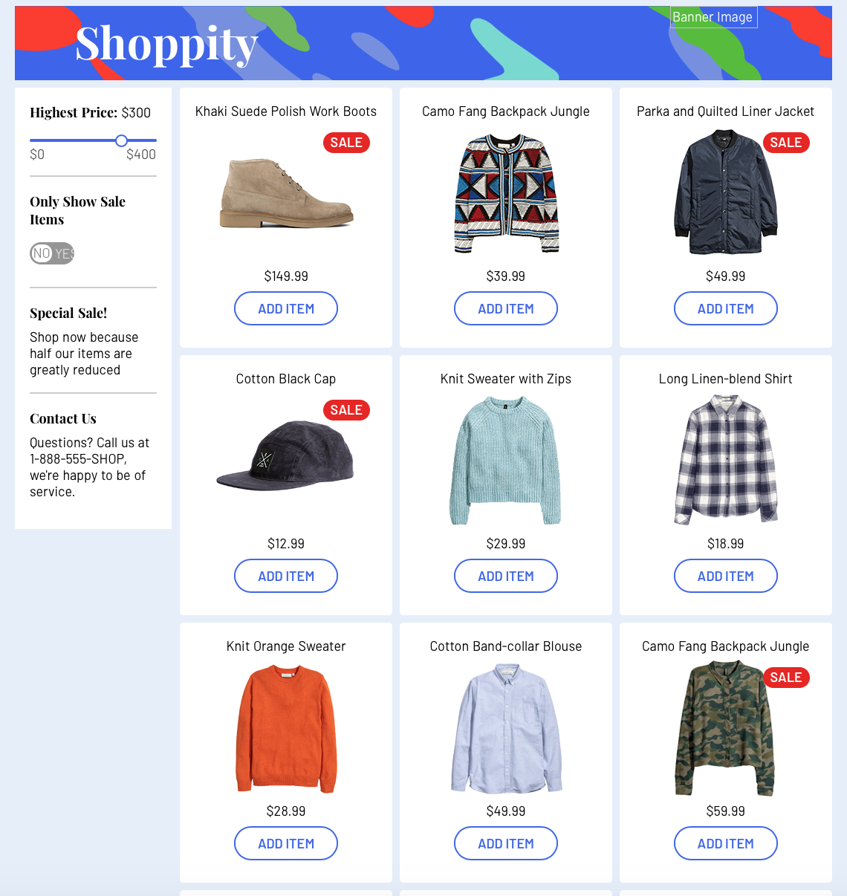

# rpcx演示程序 



## 1. 首先生成前端

前端程序克隆自[sample-vue-shop](https://github.com/sdras/sample-vue-shop), 只是把其中的商品图片由静态改为从动态服务提供。

```sh
$ npm install 

$ npm run generate
```

## 2. 启动图片rpcx服务

```
cd ./service
go run service.go
```

## 3. 启动后台web服务

web服务会启动一个http server, 提供静态的前端页面以及动态的商品图片。

它收到商品图片的请求后，会调用rpcx服务获取图片的数据，然后再返回前端。


```
cd ./backend
go run backend.go
```
## 4. 访问网址

查看demo `http://localhost:8080`
